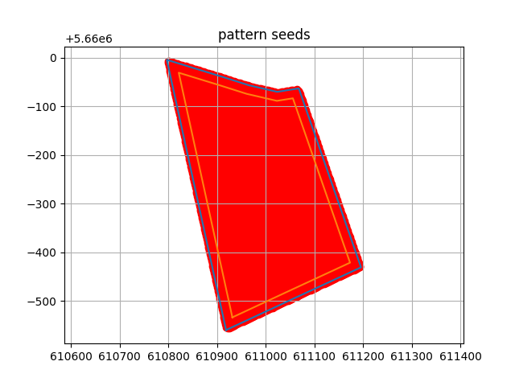

# Investigation and improvement of the optimisation function for the generation of a sowing map in equidistant sowing

## Untersuchung und Verbesserung der Optimierungsfunktion für die Generierung einer Aussaatkarte in der Gleichstandssaat

The purpose of this project is to simulate seed sowing on a plot, enabling drone operation, and to calculate the most optimized sowing methods.

## Table of Contents

- [Introduction](#introduction)
- [Installation](#installation)
- [Usage](#usage)
- [Contact](#contact)

## Introduction

This is a project designed to simulate equilateral triangle sowing in a plot. 
It serves as a bachelor's thesis and is part of the "Spot farming – an alternative for future plant production" project. 
The project enables the division and sowing of plots to accommodate the characteristics of drone sowing. 
It can also identify the most optimized sowing methods for reference. 

## Installation

Ensure that Python and Git are installed.
A virtual environment is a recommended option, but it is not mandatory.
```bash
# Clone the repository
git clone https://github.com/CarrQuin/Sowing-planning.git

# Navigate to the project directory
cd Sowing-planning

# Create and activate a virtual environment
python -m venv venv

source venv/bin/activate  # On Windows, use `venv\Scripts\activate`

# Install the dependencies
pip install -r requirements.txt.
```

## Usage 

As a user, you only need to use the file "Aussaatplanung_script.py". In the variable section, 
you can input the variables you want to control and specify the file type for saving.  
You can also choose to enable optimization mode, which may take more time.

For now, adding a graphical user interface is not being considered.

```python
# =====Variables=====
# File path to read.
kml_file_path = r"KML-Dateien\feld 1.kml"
# Whether to save the results in CSV format, with an alternative KML
save_as_csv = True
#Spacing between adjacent seeds, in [m]
distance = 3.5
# Whether to use an optimization algorithm.
optimal = False
# (OPT)Number of displacement optimization iterations.(Up to a max. of 100.)
move_iter = 5
# (OPT)Number of displacement optimization iterations.(Up to a max. of 60.)
angle_iter = 6
```

When setting parameters, please note the following:
 * The plot should preferably not have rounded corners at the boundary vertices.
 * The outline of the plot to be sown should preferably not be a concave polygon.

You can also run it once with the default variables to see the actual effect.
Click "Run Python File" on the right side of the title bar to run the current file.  
Under the above conditions, the following results can be expected:
```bash
The new total points: 12097
D:\Path\to\your\project\Sowing-planning\Koordinaten_Saatpunkte.csv
new_Transto-time: 0.001950979232788086 seconds
new_Pattern-time: 0.12817740440368652 seconds
new_transback-time: 0.16195344924926758 seconds
new_savedate-time: 0.10895490646362305 seconds
new_Fulltime: 0.40103673934936523 seconds
```
Additionally, an image will be generated.



## Contact

If you encounter any problems while using it, feel free to contact:

 * Email: k.qian@tu-braunschweig.de